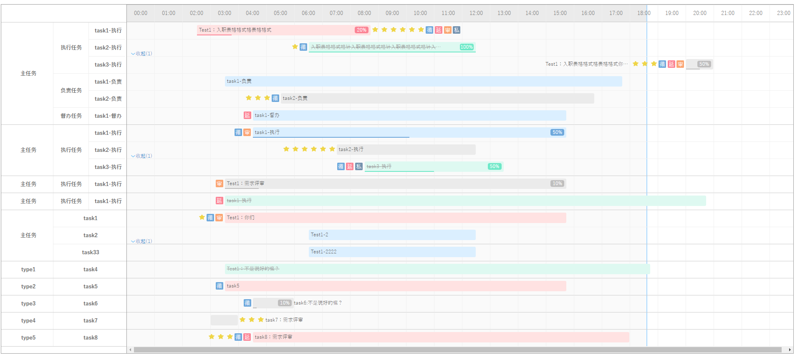
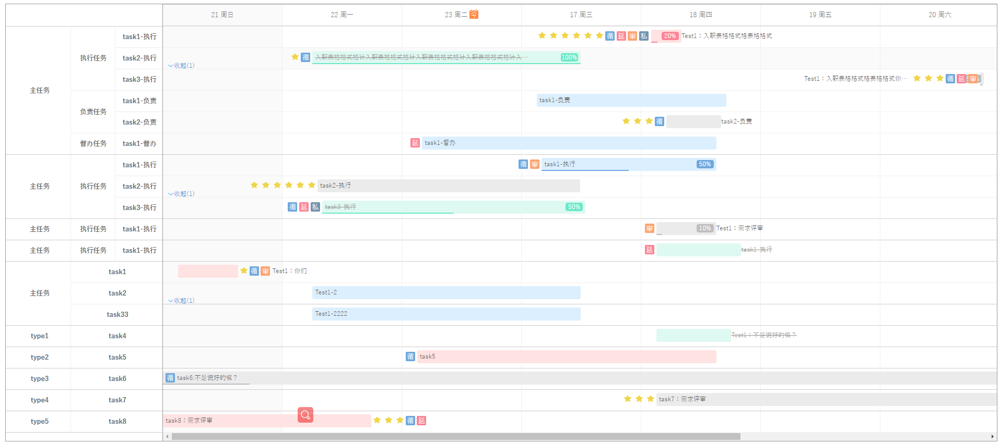
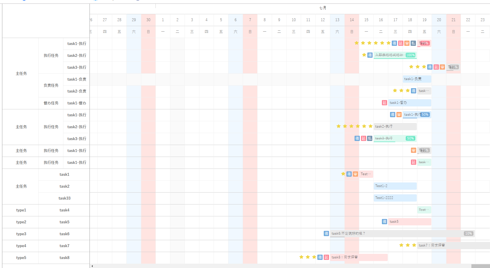
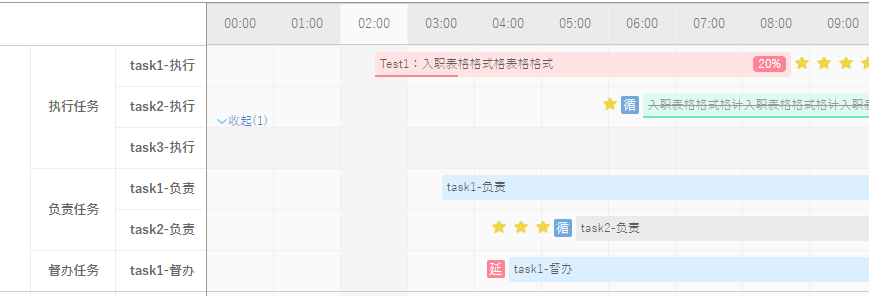
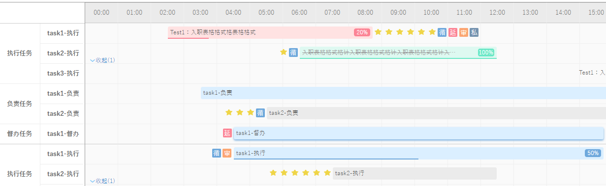

# GanttView
基于JQ的一款灵活高效，支持自定义拓展的甘特图/日程图插件
> 支持月/周/小时等显示方式
> 支持拖动改变时间
> 展开与收起
> 添加/删除，刷新
> 节假日高亮
> clicked，dblClicked，changed事件
> ...

####  调用方式：  #
<pre>
  <code>
       $("#ganttChart").ganttView({
            ganttScale: "hours",// months  weeks days  hours
            showWeekends: true, //是否现在周末高亮
            showLine: true,//是否显示 当前时间线(为"周"时显示背景颜色)
            data: ganttData2, //数据来源
            vtHeaderWidth: 300,//左侧任务模块宽度
            cellWidth: 50, //格子宽度(ganttScale = hours/weeks:宽度重新计算 最小为50)
            cellHeight: 40,//格子行高
            titileHeight: 40,//标题行高
            start: new Date(2019, 06, 14), //范围最小时间(请根据 ganttScale 参数调节初始时间范围)
            end: new Date(2019, 06, 20), //范围最大时间
            slideWidth: '100%',//甘特图宽度
            excludeWeekends: true,//排除星期的最后一天
            showDayOfWeek: true,//是否显示星期
            showHolidays: false,//显示节假日
            excludeHolidays: false,//排除节假日
            gridHoverL:true,//是否显示鼠标移入效果(列)
            gridHoverH:true,//是否显示鼠标移入效果(行)
            isUnfold:true,//模块下任务超过2条 显示展开收起按钮
            unfoldConfig:false,//初始化展开/收起(模块下任务超过2条 显示展开收起按钮) true:收起
            clicked: function (o) {
                selectedObj = o;
                var data = selectedObj.data('block-data');
                var itemName = data.itemName ? data.itemName : "";
                var seriesName = data.seriesName ? data.seriesName : "";
                var text = data.text ? data.text : "";
                var sYYYY = data.start.getYear();
                sYYYY = sYYYY < 1000 ? sYYYY + 1900 : sYYYY;
                var sMM = data.start.getMonth() + 1;
                var sDD = data.start.getDate();
                var eYYYY = data.end.getYear();
                eYYYY = eYYYY < 1000 ? eYYYY + 1900 : eYYYY;
                var eMM = data.end.getMonth() + 1;
                var eDD = data.end.getDate();
                $('#ganttData-item-id').val(data.itemId);
                $('#ganttData-item-name').val(itemName);
                $('#ganttData-series-id').val(data.seriesId);
                $('#ganttData-series-name').val(seriesName);
                $('#ganttData-series-start').val(sYYYY + "/" + sMM + "/" + sDD);
                $('#ganttData-series-end').val(eYYYY + "/" + eMM + "/" + eDD);
                $('#ganttData-series-text').val(text);
                console.log(`${data.itemId} ${itemName} ${data.seriesId} ${seriesName} ${sYYYY + "/" + sMM + "/" + sDD} ${eYYYY + "/" + eMM + "/" + eDD}`)
            },

            dblClicked: function (o) {
                if (selectedObj == null) { return; }
                if (selectedObj.data('block-data').seriesId == o.data('block-data').seriesId) {
                    $('#ganttData-reset').trigger("click");
                }
            },
            changed: function (o) {
                o.trigger("click");
            }
        });
  </code>
</pre>

####  注意事项：  #

* 支持月，周，小时
* 选择月时，注意调整start/end时间(时间月份默认从0开始)
* 选择周/小时，插件自动忽略年份与月份
* 插件支持模块下任务超过2条数据自动显示展开/收起按钮
* 插件支持节假日Holidays表格高亮，excludeHolidays:true
* cellWidth表格宽度(ganttScale = hours/weeks:宽度重新计算 最小为50) 避免未撑满整个屏幕
* showLine是否显示当前时间节点(小时为线条展示，周/月为表格高亮)
* 关于版本问题(jquery-ui-1.8.2/jquery-1.4.2)JQ版本可为高版本，JQ-ui版本暂不支持高版本
* 图表上所有样式可自定义或取消

